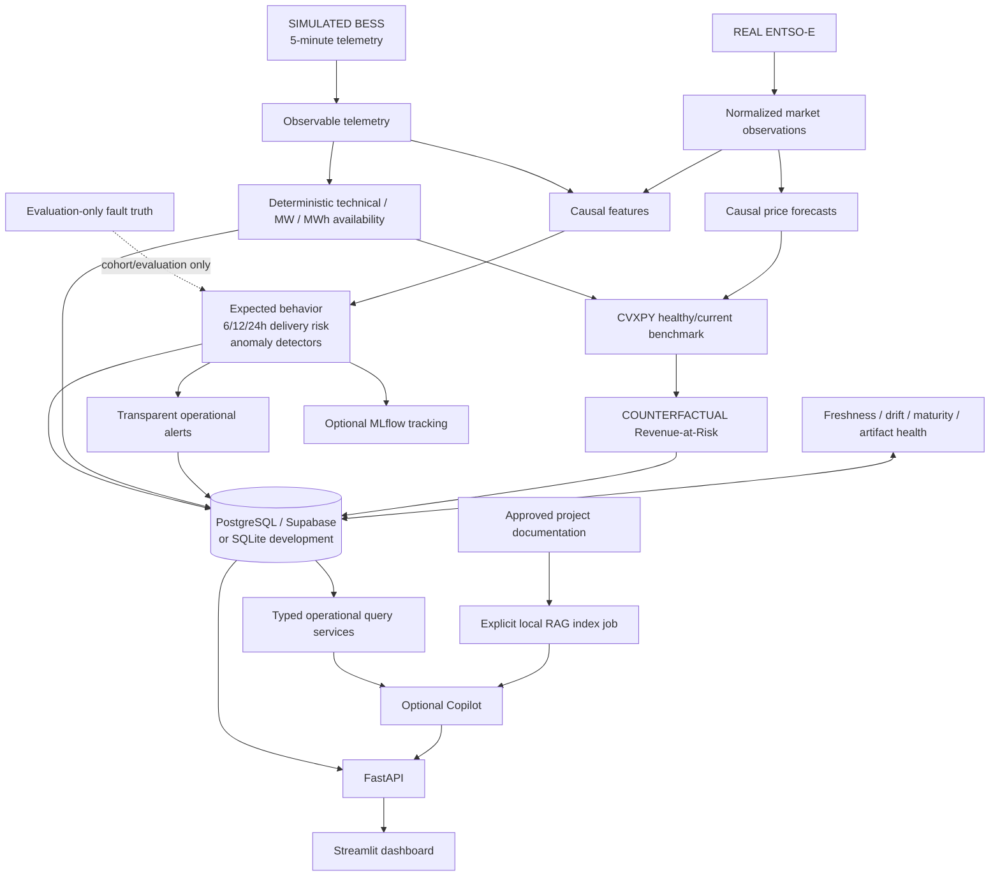
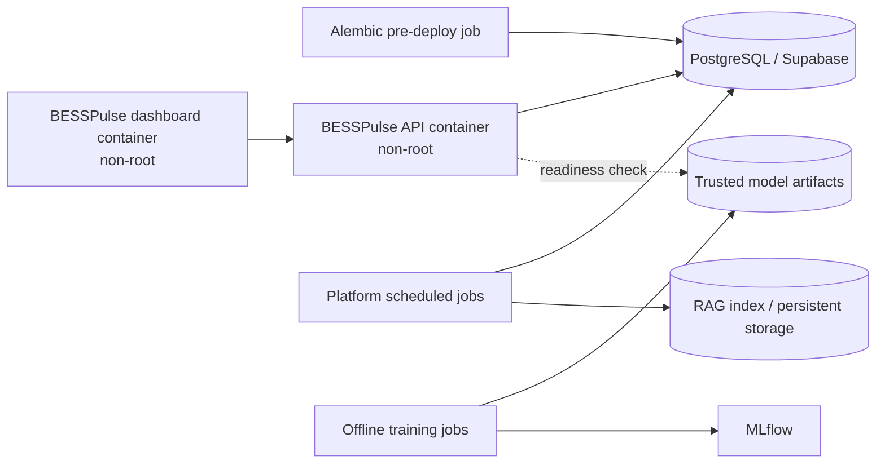

# BESSPulse architecture

## System topology

## Scientific boundaries

- Telemetry contains observables only. Fault truth is isolated in `ground_truth.py` and evaluation datasets.
- Positive power is discharge; negative power is charge.
- Features reject duplicate identities, naive timestamps, leakage columns, and infinities. Rolling windows are causal, peer features exclude self, and market joins are backward-only.
- Expected-behavior residuals used historically are walk-forward: each prediction comes from strictly earlier healthy training rows.
- Delivery-risk labels use `(T, T+h]`, censor incomplete tails, purge target-window overlap, and keep 6/12/24-hour artifacts independent.
- Anomaly scores remain detector scores, never failure probabilities.
- Availability is deterministic and cannot be changed by risk/anomaly context.
- Revenue-at-Risk is a healthy-versus-current counterfactual benchmark, not actual P&L or causal attribution.
- Monitoring drift is evidence of distribution change, not evidence of a battery fault.
- Documentation controls definitions; current structured tool output controls current state.

## Runtime services

FastAPI is a read-oriented delivery layer over persisted outputs. Public GET routes never train models, run large optimization, reindex RAG, or fetch market history. Simulation mutation routes are omitted entirely in production mode. Request-scoped SQLAlchemy sessions use one ORM for SQLite and PostgreSQL; PostgreSQL uses bounded pools compatible with transaction poolers and avoids session-affinity assumptions.

Streamlit owns presentation, caching, navigation, formatting, and session state. It receives only an API base URL. It does not receive database, ENTSO-E, Gemini, or Supabase server credentials. An explicitly labeled local-artifact adapter supports development demonstrations only.

The Copilot compatibility layer supports approved-document retrieval and citations. Prompt 13's expected Gemini operational-tool agent is absent, so operational-only questions fail safely and mixed questions are labeled partial. The RAG index is refreshed by an explicit job and is never rebuilt at API startup.

## Deployment topology

API and dashboard deploy independently. The production migration is an explicit release/pre-deploy command. Training and scheduled analytics do not run inside web workers. Container healthchecks use process liveness only; readiness separately reports database and model/data state.

## Persistence and observability

Alembic owns schema evolution. The baseline migration covers telemetry, market observations, predictions, anomaly events, availability, commercial outputs, alerts, and monitoring records. Composite indexes follow API access patterns.

Production logs are JSON with timestamp, level, service, event, request ID, method, path, status, and duration where applicable. URLs and secrets are excluded. `/api/v1/health/live` checks the process, `/api/v1/health/ready` checks the database, and `/api/v1/system/info` exposes only safe version/backend metadata.
