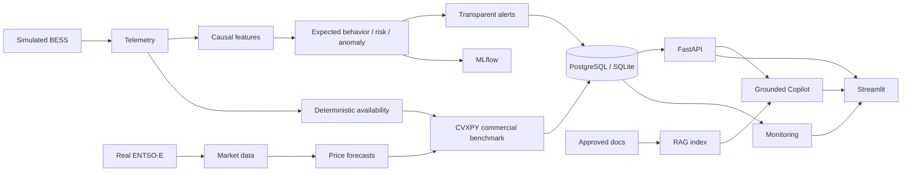

# BESSPulse

## Live Battery Availability, Failure-Risk & Revenue-at-Risk Copilot

[](https://github.com/MhdAsker/BESSPulse-Live-Battery-Availability-Failure-Risk-Revenue-at-Risk-Copilot/actions/workflows/ci.yml)

BESSPulse is a provenance-aware research and portfolio platform for grid-scale battery operations.

- Configurable BESS digital twin and deterministic fault injection
- Calibrated 6/12/24-hour delivery-risk experiments
- Multi-detector anomaly and early-warning analysis
- Directional MW/MWh availability
- Real ENTSO-E DE-LU market ingestion and price forecasting
- CVXPY healthy-versus-current Revenue-at-Risk benchmark
- FastAPI, Streamlit, RAG, MLflow, and model/data monitoring

> **Demo boundary:** BESS telemetry is simulated. ENTSO-E observations are real only when actually fetched. Revenue-at-Risk is counterfactual and is not actual commercial P&L.

## Overview

The system joins reliability engineering, chronological machine learning, deterministic capability calculations, and market context without hiding their different evidence classes. The API serves persisted results; public reads never retrain models, reindex documents, run large optimization jobs, or download market history.

## Why it exists

Operators need to distinguish four questions: what the asset can physically deliver, whether observed behavior is unusual, whether a future request is at risk, and what the capability gap could mean commercially. BESSPulse keeps those questions separate while presenting them in one operator interface.

## Architecture

The full data flow is documented in [ARCHITECTURE.md](ARCHITECTURE.md). In summary:



## Data provenance

| Label | Meaning |
|---|---|
| `SIMULATED` | Digital-twin BESS telemetry and injected scenarios |
| `REAL` | Externally observed ENTSO-E data |
| `DERIVED` | Deterministic features, residuals, availability, and monitoring |
| `MODEL_PREDICTION` | Fitted-model output |
| `COUNTERFACTUAL` | Hypothetical optimized commercial benchmark |
| `AI-GENERATED EXPLANATION` | Optional synthesized explanation; evidence keeps its original label |

Fault ground truth is evaluation-only and is never exposed as operational evidence.

## Key capabilities

The simulator supports configurable power, energy, PCS/rack topology, five-minute telemetry, deterministic seeds, and ten transparent fault families. Feature generation uses causal windows, backward-only market alignment, and leave-one-out peer statistics. Expected-power and expected-temperature models produce walk-forward residuals. Delivery-risk targets use `(T, T+h]` semantics, censoring, horizon-specific purge gaps, and chronological splits.

## ML methodology

Model selection uses training and validation periods; the test period is evaluated once. Preprocessing is fit on training data only. Dataset, feature-set, artifact, target, and model versions are retained. See [ML_METHODOLOGY.md](ML_METHODOLOGY.md), [MODEL_CARD.md](MODEL_CARD.md), and [TARGET_DEFINITION.md](TARGET_DEFINITION.md).

The simulated 24-hour delivery-risk model has known poor out-of-time calibration. That limitation remains visible in MLflow metadata, monitoring, alerts, API responses, and the dashboard.

## Anomaly detection

Engineering rules, robust peer comparisons, Isolation Forest, residual detectors, and a transparent vote ensemble remain separate. Anomaly scores are not probabilities. Evaluation reports event detection rate, false alerts per healthy day, and detection delay. See [docs/ANOMALY_DETECTION.md](docs/ANOMALY_DETECTION.md).

## Availability

Availability is deterministic and distinguishes technical state, charge/discharge power, deliverable energy, charge headroom, and current requested-power sufficiency. See [AVAILABILITY_DEFINITIONS.md](AVAILABILITY_DEFINITIONS.md).

## Market data

ENTSO-E ingestion preserves immutable source XML, UTC-normalized observations, content hashes, bounded retries, and `REAL` provenance. Price forecasts use timestamp-based causal lags and chronological evaluation. See [docs/ENTSOE_INTEGRATION.md](docs/ENTSOE_INTEGRATION.md) and [docs/PRICE_FORECASTING.md](docs/PRICE_FORECASTING.md).

## Revenue-at-Risk

CVXPY/HiGHS compares healthy and current constrained dispatch. Outputs are `COUNTERFACTUAL`: **Counterfactual historical simulation, not actual commercial P&L.** Attribution is diagnostic decomposition, not causal proof. See [REVENUE_AT_RISK.md](REVENUE_AT_RISK.md).

## AI Copilot and RAG

Approved-document retrieval is available with stable source/section citations. Documentation defines methodology; structured tools must control current state. This repository does not contain the previously expected Prompt 13 Gemini operational-tool agent, so current-state questions are refused rather than guessed. Gemini remains optional. See [docs/COPILOT.md](docs/COPILOT.md) and [docs/RAG.md](docs/RAG.md).

## Monitoring

Monitoring covers freshness, data quality, PSI/Wasserstein drift, residual behavior, prediction distributions, mature-label performance, 24-hour rolling Brier score, and artifact integrity. Drift is model/data change, not a battery fault. See [docs/MODEL_MONITORING.md](docs/MODEL_MONITORING.md).

## Screenshots

The ten-page dark operations dashboard includes Fleet Overview, Live Asset, Rack Heatmap, ML Health, Delivery Risk, Market Context, Revenue-at-Risk, Alerts, AI Copilot, and Model Monitoring. Screenshots are intentionally not fabricated; add captured public-demo images under `docs/images/` after deployment.

## Local setup

Python 3.12 is required.

```powershell
python -m venv .venv
.venv\Scripts\python -m pip install -e ".[dev]"
Copy-Item .env.example .env
alembic upgrade head
```

Terminal 1:

```powershell
python -m uvicorn api.main:app --host 127.0.0.1 --port 8000
```

Terminal 2:

```powershell
python -m streamlit run dashboard/app.py --server.address 127.0.0.1 --server.port 8501
```

Open `http://127.0.0.1:8501`. API documentation is at `http://127.0.0.1:8000/docs`.

## Environment variables

Copy [.env.example](.env.example) and populate only what the selected service needs. Production API requires a PostgreSQL `DATABASE_URL`, explicit CORS origins, and disabled simulation controls. Streamlit needs only `BESSPULSE_API_URL` and presentation settings. ENTSO-E, Gemini, MLflow, and RAG are optional subsystems and do not block core startup. Never put backend credentials in Streamlit secrets or browser code.

## Testing

```powershell
pytest -q
ruff check .
ruff format --check .
mypy src api dashboard
python scripts/check_secrets.py
```

Live ENTSO-E, Gemini, and PostgreSQL tests remain opt-in.

## Docker

```powershell
docker compose up --build
```

The compose stack runs PostgreSQL, an explicit Alembic migration job, FastAPI, and Streamlit as separate services. Both application images run as a non-root user. See [docs/DEPLOYMENT.md](docs/DEPLOYMENT.md).

## Deployment

`render.yaml` describes separate API and dashboard services. `.github/workflows/ci.yml` performs quality, migration, secret, PostgreSQL, and image checks; deployment hooks live in the separate deployment workflow. Platform secrets must supply production values. No public deployment URL is claimed until externally verified.

## Limitations

- Single-asset synthetic BESS validation; no real-site predictive validation.
- No authentication or tenant isolation; intended public mode is read-only portfolio/demo use.
- Prompt 13 operational Gemini agent/tool orchestration is absent.
- Local RAG is suitable for the small document corpus; pgvector is not implemented.
- Model artifacts are generated outside Git and need an explicit production artifact strategy.
- Monitoring thresholds are project assumptions, not universal statistical standards.

## Roadmap

Real-site shadow validation, authenticated role-based operations, durable production artifacts, pgvector if corpus scale warrants it, and independently governed alert/model retraining workflows.

## License

No license has been selected. All rights remain with the repository owner until a license is added.
